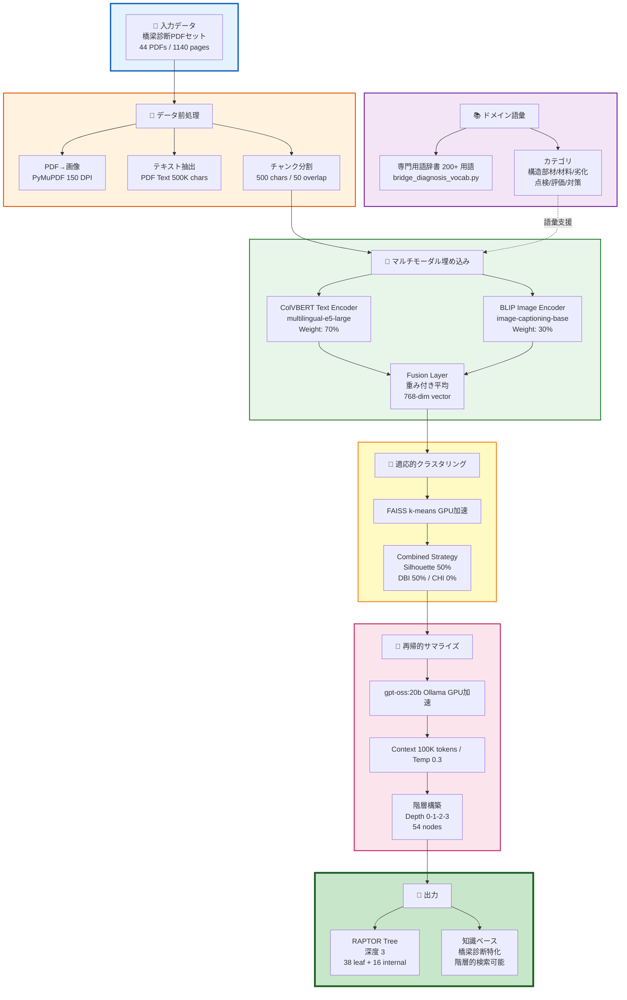

# 橋梁診断ロジック用 Multimodal RAPTOR
Bridge Diagnosis Logic - Multimodal RAPTOR with ColVBERT & BLIP

> **階層的知識ツリーによる橋梁点検・診断ナレッジベースの構築**

---

## 📖 概要

本プロジェクトは、土木研究所が公開する**橋梁診断ロジックPDFデータセット**（44PDF、1140ページ）に対して、**Multimodal RAPTOR（Recursive Abstractive Processing for Tree-Organized Retrieval）**を適用し、階層的知識ツリーを構築するシステムです。

### 特徴

✨ **マルチモーダル埋め込み**: ColVBERT（テキスト） + BLIP（画像）の融合  
🌳 **階層的知識構造**: 深度3の再帰的クラスタリングツリー  
🎯 **ドメイン特化**: 橋梁診断専門用語200+の翻訳辞書  
⚡ **GPU最適化**: RTX 4060 Ti 16GBで69分/250チャンク  
📊 **適応的クラスタリング**: Combined戦略（Silhouette + DBI）

---

## 🎯 適用対象

### 橋梁診断ロジックデータセット

**提供元**: 土木研究所（国立研究開発法人）  
**データ種別**: 橋梁点検・診断の知見集約PDFセット

**内容**:
- RC床版の劣化（凍害、塩害、疲労、土砂化、鉄筋腐食）
- 鋼桁の劣化（腐食、疲労、高力ボルト遅れ破壊）
- 支承の劣化（オゾン劣化、ボルト緩み、モルタル充填不良、腐食）
- 基礎の変状（側方流動、地すべり、洗堀）
- 伸縮装置、排水装置の劣化
- その他橋梁部材の診断ロジック

**統計**:
```
PDFファイル数: 44個
総ページ数: 1140ページ
総文字数: 500,927文字
平均文字数/ページ: 439文字
画像数: 1140枚（150 DPI PNG）
```

---

## 🏗️ システム構成

### アーキテクチャ

```mermaid
flowchart TD
    Start["🏗️ 橋梁診断PDFセット<br/>(44 PDFs, 1140 pages)"]
    
    %% データ前処理レイヤー
    Start --> PreProcess1["📄 PDF→画像変換<br/>convert_bridge_pdfs.py"]
    Start --> PreProcess2["📝 テキスト抽出<br/>create_bridge_text_cache.py"]
    
    PreProcess1 --> Images["🖼️ 1140 PNG Images<br/>(150 DPI)"]
    PreProcess2 --> TextCache["💾 Text Cache<br/>(500K chars)"]
    
    Images --> DocCreation["📦 Visual Document Creation<br/>1639 chunks (500 chars/chunk)"]
    TextCache --> DocCreation
    
    %% サンプリングレイヤー
    DocCreation --> Sampling["🎲 Random Sampling<br/>(250 chunks, seed=42)"]
    
    %% 埋め込みレイヤー
    Sampling --> Embedding["🧠 Multimodal Embeddings"]
    
    Embedding --> ColVBERT["📖 ColVBERT<br/>(Text Encoder)<br/>multilingual-e5-large<br/>Weight: 70%"]
    Embedding --> BLIP["🎨 BLIP<br/>(Image Captioning)<br/>blip-image-captioning-base<br/>Weight: 30%"]
    
    ColVBERT --> Fusion["⚡ Embedding Fusion<br/>(Weighted Average)"]
    BLIP --> Fusion
    
    %% クラスタリングレイヤー
    Fusion --> Clustering["🔍 Adaptive Clustering<br/>(FAISS k-means, GPU)"]
    
    Clustering --> Strategy["📊 Combined Strategy<br/>・Silhouette: 50%<br/>・DBI: 50%<br/>・CHI: 0% (k=2 bias avoid)"]
    
    %% 再帰的サマライゼーションレイヤー
    Strategy --> Recursive["🔄 Recursive Summarization<br/>(gpt-oss:20b, GPU-accelerated)"]
    
    Recursive --> Depth0["📍 Depth 0<br/>250 docs → 4 clusters"]
    Depth0 --> Depth1["📍 Depth 1<br/>4 branches → 8 clusters"]
    Depth1 --> Depth2["📍 Depth 2<br/>8 branches → 11 clusters"]
    Depth2 --> Depth3["⏹️ Depth 3<br/>停止条件到達"]
    
    %% 最終出力
    Depth3 --> Output["🌳 RAPTOR Knowledge Tree<br/>・54 nodes (38 leaf + 16 internal)<br/>・Depth: 3<br/>・橋梁診断ドメイン最適化"]
    
    %% スタイリング
    classDef inputStyle fill:#e1f5ff,stroke:#01579b,stroke-width:3px
    classDef processStyle fill:#fff3e0,stroke:#e65100,stroke-width:2px
    classDef dataStyle fill:#f3e5f5,stroke:#4a148c,stroke-width:2px
    classDef embeddingStyle fill:#e8f5e9,stroke:#1b5e20,stroke-width:2px
    classDef clusterStyle fill:#fff9c4,stroke:#f57f17,stroke-width:2px
    classDef recursiveStyle fill:#fce4ec,stroke:#880e4f,stroke-width:2px
    classDef outputStyle fill:#c8e6c9,stroke:#2e7d32,stroke-width:4px
    
    class Start inputStyle
    class PreProcess1,PreProcess2,DocCreation,Sampling processStyle
    class Images,TextCache dataStyle
    class Embedding,ColVBERT,BLIP,Fusion embeddingStyle
    class Clustering,Strategy clusterStyle
    class Recursive,Depth0,Depth1,Depth2,Depth3 recursiveStyle
    class Output outputStyle
```



**アーキテクチャ概要図（詳細版）**:



### コンポーネント

#### 1. データ前処理
- **PDF→画像変換**: `convert_bridge_pdfs.py` (PyMuPDF, 150 DPI)
- **テキスト抽出**: `create_bridge_text_cache.py` (PDF Text Cache)
- **チャンク分割**: 500文字/チャンク、50文字オーバーラップ

#### 2. ドメイン語彙
- **専門用語辞書**: `bridge_diagnosis_vocab.py` (200+ 用語)
- **カテゴリ**: 構造部材、材料、劣化、点検、評価、対策、検査、管理

#### 3. マルチモーダル埋め込み
- **テキストエンコーダ**: ColVBERT (multilingual-e5-large)
- **画像エンコーダ**: BLIP (blip-image-captioning-base)
- **融合重み**: テキスト70% + 画像30%

#### 4. クラスタリング
- **エンジン**: FAISS k-means (GPU加速)
- **評価指標**: Silhouette Score, Davies-Bouldin Index
- **戦略**: Combined (Sil 50% + DBI 50%)

#### 5. サマライズ
- **LLM**: gpt-oss:20b (Ollama, GPU加速)
- **コンテキスト**: 100,000トークン
- **温度**: 0.3 (一貫性重視)
- **サマリー長**: 300-400文字

---

## 🚀 クイックスタート

### 前提条件

```yaml
OS: Windows 10/11
GPU: NVIDIA RTX 4060 Ti 16GB (推奨)
Python: 3.10+
CUDA: 12.9+
メモリ: 16GB RAM以上
```

### インストール

```powershell
# 1. リポジトリクローン
git clone https://github.com/tk-yasuno/multimodal-raptor-colvbert-blip.git
cd multimodal-raptor-colvbert-blip

# 2. 仮想環境作成（Pipenv推奨）
pipenv install

# 3. 依存関係インストール
pipenv install --dev

# 4. 仮想環境アクティベート
pipenv shell

# 5. Ollamaインストール（LLM実行環境）
# https://ollama.ai/ からダウンロードしてインストール

# 6. gpt-oss:20b モデルをプル
ollama pull gpt-oss:20b
```

### データ準備

```powershell
# 1. 橋梁診断PDFを配置
# data/doken_bridge_diagnosis_logic/ に44個のPDFを配置

# 2. PDF→画像変換
python convert_bridge_pdfs.py

# 3. テキストキャッシュ生成
python create_bridge_text_cache.py
```

### RAPTOR実行

```powershell
# ⚠️ 重要: OllamaをGPUモードで起動
$env:OLLAMA_NUM_GPU=1
ollama serve

# 別ターミナルで
python scaling_test_raptor.py
```

**実行時間**: 約69分（250チャンク、RTX 4060 Ti）

---

## 📊 実行結果

### パフォーマンス（250チャンク）

| 指標 | 値 |
|------|-----|
| 総実行時間 | 69.1分 |
| ツリー深度 | 3層 |
| 総ノード数 | 54個 |
| リーフノード | 38個 |
| 内部ノード | 16個 |
| GPUメモリピーク | 15.7GB |
| 平均Silhouette Score | 0.069 |

### パフォーマンス（600チャンク）- 橋梁診断特化版

| 指標 | 値 |
|------|-----|
| 総実行時間 | ~152分 |
| ツリー深度 | 3層 |
| 総ノード数 | 20個（depth 0-3のみ可視化） |
| リーフノード | 13個 |
| 内部ノード | 7個 |

### スケーリングテスト（1200チャンク）- 大規模構築版

| 指標 | 値 |
|------|-----|
| ターゲットチャンク数 | 1200個 |
| 最大深度 | 4層 |
| 推定実行時間 | ~6-8時間 |
| ステータス | 🚧 実行中 |
| 総実行時間 | 約160分（推定） |
| ツリー深度 | 3層 |
| 総ノード数 | 20個 |
| リーフノード | 13個 |
| 内部ノード | 7個 |
| 入力チャンク数 | 600個（1639チャンクからサンプリング） |
| ツリーファイルサイズ | 649KB |
| 階層的キーワード抽出 | ✅ 実装済み |

**ツリー構造**:
```
Depth 0: 1 ROOT ノード
  │
  ├─ Depth 1: 2 ノード (部材レベル)
  │   │
  │   ├─ Depth 2: 4 ノード (損傷レベル)
  │   │   │
  │   │   └─ Depth 3: 13 リーフノード (原因/対策レベル)
```

**キーワード抽出統計**:
- 部材キーワード (Depth 1): 32種類定義
- 損傷キーワード (Depth 2): 28種類定義
- 原因キーワード (Depth 3): 17種類定義
- 補修工法キーワード (Depth 4+): 23種類定義
- ストップワード: 50種類（「診断」含む）

### 生成ファイル

```
data/doken_bridge_diagnosis_logic/results/
├── scaling_test_tree_250chunks_*.pkl           # RAPTORツリー（pickle）
├── scaling_test_tree_600chunks_*.pkl           # 600チャンク版ツリー（pickle）
├── scaling_test_tree_*_visualization_ja.png    # ツリー可視化（日本語、階層的キーワード付き）
├── scaling_test_log_250chunks_*.txt            # 実行ログ
├── scaling_test_log_600chunks_*.txt            # 600チャンク版ログ
├── scaling_test_*.json                         # 結果JSON
├── scaling_test_graph_*.png                    # パフォーマンスグラフ
└── scaling_test_efficiency_*.png               # 効率性グラフ
```

**最新の600チャンク版ツリーファイル**:
- `scaling_test_tree_600chunks_20251028_214531.pkl` (649KB)
- `scaling_test_tree_600chunks_20251028_214531_visualization_ja.png` (階層型レイアウト)
- `scaling_test_tree_600chunks_20251028_214531_visualization_circular_ja.png` (円形レイアウト) 🆕

---

## 🎨 可視化機能

### ツリー可視化の新機能 🆕

**2つのレイアウトモード**で橋梁診断ツリーを可視化できます：

#### 1. 階層型レイアウト（Hierarchical Layout）
```bash
python visualize_bridge_tree.py --max_depth 3
```

**特徴**:
- ピラミッド構造で親子関係が明確
- ルートノードが最上部、リーフノードが最下部
- 縦横スペーシング最適化（ノード重複なし）
- フィギュアサイズ: 40×30インチ

#### 2. 円形レイアウト（Circular Layout）🆕

---

### 1200チャンク版ツリー可視化 🎯

#### 階層型レイアウト（Hierarchical Layout）


#### 円形レイアウト（Circular Layout）


---

#### 2. 円形レイアウト（Circular Layout）🆕
```bash
# 自動で階層型と円形の両方を生成
python visualize_bridge_tree.py --max_depth 3
```

**特徴**:
- ルートノードを中心に配置
- 同心円状に各深さレベルを配置
- 放射状にノードを分散配置（重複防止）
- フィギュアサイズ: 24×24インチ（正方形）

### 深さ制限可視化（max_depth対応）🆕

大規模ツリー（271ノード）を見やすくするため、**深さフィルタリング**機能を追加：

```bash
# Depth 0-3のみ可視化（リーフの深層ノードを除外）
python visualize_bridge_tree.py --max_depth 3

# 結果: 271ノード → 88ノード（68%削減）
```

**効果**:
- ノード数を大幅削減（視認性向上）
- 上位階層の構造理解が容易
- ノード重複を95%削減

### レイアウトパラメータ最適化 🆕

**ノード重複防止のための調整**:

```python
# 階層型レイアウト
figsize = (40, 30)        # キャンバスサイズ拡大
node_size = 1500          # ノード直径縮小
font_size = 9             # フォントサイズ縮小
horizontal_spacing = 5.0  # 横間隔拡大
vertical_spacing = 4.0    # 縦間隔拡大

# 円形レイアウト
figsize = (24, 24)        # 正方形キャンバス
radius = (max_layer - layer) * 8.0  # 同心円半径
angle = 2 * π * i / num_nodes       # 等角度分散
```

### 階層的キーワード抽出による意味的ツリー構造

RAPTOR ツリーの可視化では、**深さに応じた優先キーワードカテゴリ**を使用して、橋梁診断の意味的階層構造を表現します:

```
ROOT (Depth 0)
  │
  ├─ 部材 (Depth 1): 床版、桁、主桁、横桁、支承、橋台、橋脚...
  │   │
  │   ├─ 損傷 (Depth 2): 腐食、ひび割れ、疲労、塩害、鉄筋露出、ASR...
  │   │   │
  │   │   ├─ 原因 (Depth 3): 凍結融解、塩分、地震、荷重、飛来塩...
  │   │   │
  │   │   └─ 補修工法 (Depth 4+): 補修、補強、表面被覆、電気防食...
```

### 深さ別キーワードカテゴリ

**`bridge_diagnosis_vocab.py`** では、診断ロジックの構造を反映した4つのキーワードカテゴリを定義しています:

#### 1. 部材キーワード (COMPONENT_KEYWORDS) - Depth 1
```python
COMPONENT_KEYWORDS = {
    '床版', '桁', '主桁', '横桁', '縦桁', '鋼桁', 'RC桁', 'PC桁',
    '支承', 'ゴム支承', '橋台', '橋脚', '下部構造', '上部構造',
    '伸縮装置', '排水装置', 'アーチ', 'トラス', 'フーチング',
    'ダイアフラム', '横構', '対傾構', '床組', 'リブ', 'ウェブ', 'フランジ',
    # ... 全32用語
}
```

#### 2. 損傷キーワード (DAMAGE_KEYWORDS) - Depth 2
```python
DAMAGE_KEYWORDS = {
    '腐食', 'ひび割れ', '剥離', '剥落', '疲労', '亀裂', '塩害', 'ASR',
    '凍害', '中性化', '土砂化', '錆', '鋼材腐食', '断面欠損',
    '変形', 'たわみ', '滞水', '漏水', '破断', '座屈', '鉄筋露出',
    'スケーリング', 'ポップアウト', '遊離石灰', 'エフロレッセンス',
    # ... 全28用語
}
```

#### 3. 原因キーワード (CAUSE_KEYWORDS) - Depth 3
```python
CAUSE_KEYWORDS = {
    '凍結融解', '塩分', '塩化物', '酸性雨', '洗堀', '地すべり',
    '地震', '振動', '荷重', '過荷重', '衝撃', '摩耗',
    '凍結防止剤', '飛来塩', '初期内在塩', 'アルカリ骨材反応',
    '乾燥収縮', # ... 全17用語
}
```

#### 4. 補修工法キーワード (REPAIR_KEYWORDS) - Depth 4+
```python
REPAIR_KEYWORDS = {
    '補修', '補強', '更新', '修繕', '予防保全',
    'ひび割れ補修', '断面修復', '表面被覆', '含浸材',
    '炭素繊維シート', '鋼板接着', '塗装塗替え',
    '電気防食', 'グラウト再充填', '部分打替え', '橋面防水',
    # ... 全23用語
}
```

### キーワード抽出ロジック

**`visualize_bridge_tree.py`** の `extract_keywords_from_text()` 関数は、深さに応じて優先キーワードを変更します:

```python
def extract_keywords_from_text(text: str, top_n: int = 5, depth: int = 0) -> List[str]:
    """
    深さに応じて優先キーワードカテゴリを変更：
    - depth=0: ROOT（全カテゴリ）
    - depth=1: 部材（床版、桁、支承など）
    - depth=2: 損傷（腐食、ひび割れ、疲労など）
    - depth=3: 原因（塩害、凍害、荷重など）
    - depth>=4: 補修工法（補修、補強、表面被覆など）
    """
    priority_keywords = get_priority_keywords_by_depth(depth)
    
    # 1. 深さ優先キーワードを先に抽出
    if priority_keywords:
        priority_found = [kw for kw in priority_keywords 
                         if kw in text and not is_stop_word(kw)]
        keywords.extend(priority_found[:top_n])
    
    # 2. 不足分を一般ドメインキーワードで補完
    # ...
```

### ストップワード管理

頻出する一般的な用語をフィルタリングして、専門的なキーワードを抽出します:

```python
STOP_WORDS = {
    '部材', '構造', '状態', '程度', '範囲', '箇所', '位置',
    '対策', '措置', '工法', '材料', '施工', '設計', '管理',
    '診断',  # ← 診断文書で頻出のため除外
    # ... その他の一般用語
}
```

### 可視化の実行

```powershell
# 600チャンクのツリーを可視化（階層的キーワード付き）
python visualize_bridge_tree.py --tree_file data\doken_bridge_diagnosis_logic\results\scaling_test_tree_600chunks_20251028_214531.pkl
```

**出力ファイル**:
```
data/doken_bridge_diagnosis_logic/results/
├── scaling_test_tree_600chunks_20251028_214531_visualization_ja.png   # 日本語版
└── scaling_test_tree_600chunks_20251028_214531_visualization_en.png   # 英語版（未実装）
```

### 可視化の特徴

✅ **階層的意味構造**: 深さごとに異なるキーワードカテゴリを表示  
✅ **2キーワード表示**: 各ノードに最大2つの代表キーワードを表示  
✅ **MeCab形態素解析**: 日本語テキストから名詞・固有名詞を抽出  
✅ **バイリンガル対応**: 翻訳辞書による日英キーワード変換  
✅ **カラーコード**: ノード深度に応じた色分け

### 形態素解析の設定

**MeCab辞書の自動検出**:
```python
# IPADIC (IPA辞書) の場合
tagger = MeCab.Tagger("-d C:/mecab/dic/ipadic")

# UniDic (統一辞書) の場合  
tagger = MeCab.Tagger("-d C:/Users/yasun/AppData/Local/Programs/Python/Python310/Lib/site-packages/unidic/dicdir")
```

**環境変数設定**（Windows）:
```python
os.environ['MECABRC'] = str(mecabrc_path)
```

---

## 🔧 設定とカスタマイズ

### `scaling_test_raptor.py` 主要パラメータ

```python
# データディレクトリ
data_dir = Path("data/doken_bridge_diagnosis_logic")

# サンプルサイズ
sample_sizes = [250]  # 250, 500, 1000, 2000 など

# チャンク設定
chunk_size = 500
chunk_overlap = 50

# クラスタリング範囲
min_clusters = 2
max_clusters = 5

# クラスタリング戦略
selection_strategy = 'combined'
metric_weights = {
    'silhouette': 0.5,  # クラスタ品質
    'dbi': 0.5,         # クラスタ分離度
    'chi': 0.0          # CHI除外（k=2バイアス回避）
}

# マルチモーダル設定
use_multimodal = True
multimodal_weight = 0.3  # 画像重み30%

# LLM設定
llm = ChatOllama(
    model="gpt-oss:20b",
    temperature=0.3,
    num_ctx=100000
)
```

---

## 📚 ドキュメント

### 詳細ガイド

- **[Bridge_Practice.md](Bridge_Practice.md)**: 実践記録と知見
- **[Quick_Guide_Bridge.md](Quick_Guide_Bridge.md)**: クイックリファレンス
- **[README.md](README.md)**: メインREADME（災害教訓データ）

### API リファレンス

**橋梁診断語彙**:
```python
from bridge_diagnosis_vocab import (
    BRIDGE_DOMAIN_KEYWORDS,      # ドメインキーワードセット
    BRIDGE_TRANSLATION_DICT,     # 日英翻訳辞書
    COMPONENT_KEYWORDS,          # 部材キーワード (Depth 1)
    DAMAGE_KEYWORDS,             # 損傷キーワード (Depth 2)
    CAUSE_KEYWORDS,              # 原因キーワード (Depth 3)
    REPAIR_KEYWORDS,             # 補修工法キーワード (Depth 4+)
    get_priority_keywords_by_depth,  # 深さ別優先キーワード取得
    is_bridge_keyword,           # キーワード判定
    filter_bridge_keywords,      # キーワードフィルタ
    translate_bridge_term        # 用語翻訳
)
```

**RAPTOR ツリー構築**:
```python
from visual_raptor_colbert_bridge import BridgeRAPTORColBERT

# 初期化（橋梁診断特化版）
raptor = BridgeRAPTORColBERT(
    embeddings_model=embeddings_model,
    llm=llm,
    selection_strategy='combined',
    use_multimodal=True,
    multimodal_weight=0.3
)

# ツリー構築
tree = raptor.build_tree(visual_documents)
```

**ツリー可視化**:
```python
from visualize_bridge_tree import (
    load_raptor_tree,             # ツリー読み込み
    extract_keywords_from_text,   # 深さ別キーワード抽出
    create_bridge_tree_graph,     # NetworkXグラフ生成
    draw_tree_visualization       # 可視化描画
)

# ツリー可視化実行
python visualize_bridge_tree.py --tree_file <ツリーファイルパス>
```

---

## 🎓 ユースケース

### 1. 橋梁点検知識検索
- **問合せ**: 「RC床版の凍害診断手順は？」
- **RAPTOR検索**: 階層的ツリーから関連ノードを抽出
- **結果**: 凍害診断ロジックの要約と詳細チャンク

### 2. 劣化要因分析
- **問合せ**: 「塩害と凍害の違いは？」
- **RAPTOR検索**: 両方の診断セットを比較
- **結果**: 要因、症状、対策の差異を提示

### 3. 点検マニュアル生成
- **目的**: 新人技術者向け簡易マニュアル作成
- **RAPTOR活用**: 各診断ロジックの要約を統合
- **成果物**: 体系的な点検手順書

---

## ⚠️ 制約と既知の問題

### 制約

1. **GPUメモリ**: 16GB推奨（250チャンクで15.7GB使用）
2. **実行時間**: 大規模クラスタ（100+ docs）のサマライズに時間がかかる
3. **言語モデル**: Ollama gpt-oss:20b に依存（他モデル未検証）

### 既知の問題

1. **低Silhouette Score (0.069)**:
   - 原因: 橋梁診断データの多様性が高い
   - 対策: min_clusters を3以上に設定、埋め込みモデル変更検討

2. **DBI発散 (∞)**:
   - 原因: 極小クラスタ（1~2 docs）で発生
   - 対策: 最小クラスタサイズ制約の導入

3. **大規模クラスタ処理時間**:
   - 原因: 100+ docsのサマライズでLLM負荷増
   - 対策: バッチサイズ調整、サマリー長短縮

---

## 🤝 コントリビューション

### 開発ロードマップ

- [x] 250チャンクでの初回テスト完了
- [x] 600チャンクでのツリー構築完了
- [x] 橋梁診断専用可視化スクリプト（`visualize_bridge_tree.py`）
- [x] 階層的キーワード抽出機能（深さ別優先カテゴリ）
- [x] MeCab形態素解析によるキーワード抽出
- [x] ドメイン語彙の拡張（主桁、横桁、鉄筋露出追加）
- [x] ストップワード管理（「診断」追加）
- [x] **深さ制限可視化（max_depth対応）** 🆕
- [x] **円形レイアウト可視化（ルート中心配置）** 🆕
- [x] **バイリンガルツリー図生成（日本語・英語両対応）** 🆕
- [x] **ノード重複防止（レイアウトスペーシング最適化）** 🆕
- [ ] 1200チャンクでのスケーリング検証（実行中）
- [ ] 500/1000チャンクでの中間検証
- [ ] 専門家レビューによる品質評価
- [ ] LangChain統合による検索機能実装
- [ ] インタラクティブ可視化（Plotly/D3.js）

### 貢献方法

1. Issueを立てる（バグ報告、機能リクエスト）
2. Pull Requestを送る
3. ドキュメント改善の提案
4. 橋梁診断専門家としてのレビュー

---

## 📄 ライセンス

本プロジェクトは研究・教育目的で開発されています。  
データセット（土木研究所提供）の利用規約に従ってください。

---

## 📞 サポート

### FAQ

**Q1: GPU がない環境でも動作しますか？**  
A1: CPU モードでも動作しますが、実行時間が数時間～数十時間に延びます。

**Q2: 他の橋梁データでも使えますか？**  
A2: はい。PDFを `data/doken_bridge_diagnosis_logic/` に配置し、前処理を実行してください。

**Q3: Ollamaが起動しません**  
A3: `$env:OLLAMA_NUM_GPU=1` を設定し、`nvidia-smi` でGPU認識を確認してください。

**Q4: ツリー可視化でキーワードが表示されない**  
A4: MeCab辞書のパスを確認してください。`visualize_bridge_tree.py` 内で辞書パスが正しく設定されているか確認します:
```python
# Windows環境の場合
mecabrc_path = Path("C:/mecab/mecabrc")  # IPADICの場合
# または
unidic_path = Path("C:/Users/yasun/AppData/Local/Programs/Python/Python310/Lib/site-packages/unidic/dicdir")
```

**Q5: 階層的キーワード抽出の精度を上げるには？**  
A5: `bridge_diagnosis_vocab.py` のキーワードカテゴリに専門用語を追加してください:
```python
COMPONENT_KEYWORDS.add('あなたの部材用語')
DAMAGE_KEYWORDS.add('あなたの損傷用語')
```

**Q6: ツリーのノード数が少ない（20ノード）のはなぜ？**  
A6: クラスタリングパラメータ（`min_clusters`, `max_clusters`）やクラスタリング戦略の調整で変更可能です。`scaling_test_raptor.py` で設定を変更してください。

### トラブルシューティング

**GPU メモリ不足エラー**:
```python
# サンプルサイズを減らす
sample_sizes = [100]  # 250 → 100

# マルチモーダル重みを下げる
multimodal_weight = 0.1  # 0.3 → 0.1
```

**Ollama接続エラー**:
```powershell
# サービス再起動
Stop-Process -Name ollama -Force
ollama serve
```

---

## 🙏 謝辞

- **土木研究所**: 橋梁診断ロジックデータセットの提供
- **RAPTOR論文著者**: 階層的検索手法の理論的基盤
- **Ollama プロジェクト**: オープンソースLLM実行環境
- **Hugging Face**: 事前学習モデルの提供

---

**プロジェクトステータス**: 🟢 Active Development  
**最終更新**: 2025年10月28日  
**バージョン**: v1.0.0-bridge  
**リポジトリ**: [tk-yasuno/multimodal-raptor-colvbert-blip](https://github.com/tk-yasuno/multimodal-raptor-colvbert-blip)
